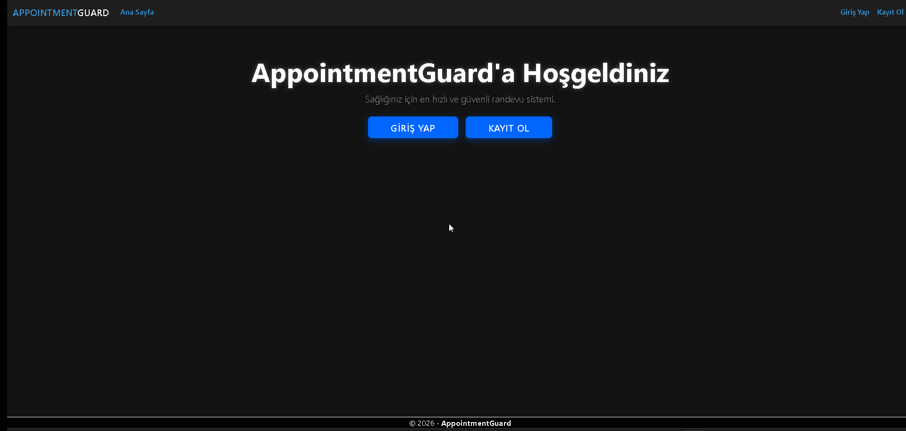
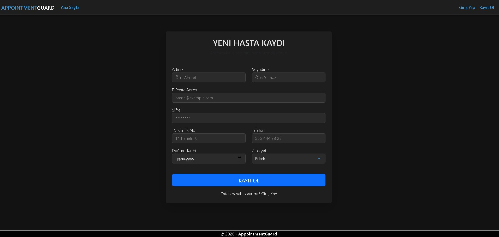

# 🏥 AppointmentGuard - N-Layer Architecture Appointment System


AppointmentGuard, kurumsal standartlara uygun **N-Katmanlı Mimari (N-Layer Architecture)** kullanılarak geliştirilmiş, güvenli ve ölçeklenebilir bir randevu yönetim sistemidir.

> **Vizyon:** Bu proje, sadece çalışan bir uygulama değil; **Concurrency (Eşzamanlılık)**, **Unit Testing** ve **Clean Architecture** prensiplerini uygulayan bir Backend mühendislik çalışmasıdır.

---

## 📸 Proje Önizlemesi (Demo)

### 1. Randevu Alma Akışı & SweetAlert2 Entegrasyonu
Kullanıcı dostu arayüz ile dinamik saat yönetimi ve anlık bildirimler.







---

## 🏗 Mimari Yapı (N-Layer Architecture)

Proje, Sorumlulukların Ayrılığı (SoC) prensibine uygun olarak katmanlara ayrılmıştır.


* **🧱 Core Layer:** Entity'ler, DTO'lar ve Arayüzler (Interfaces). Dışa bağımlılığı yoktur.
* **💾 Data Layer:** Veritabanı işlemleri, Migrations ve Repository Pattern implementasyonu.
* **⚙️ Service Layer:** İş mantığı (Business Logic), Validasyonlar (FluentValidation) ve Mapping (AutoMapper).
* **🌐 API Layer:** RESTful servisler.
* **💻 Web Layer (MVC):** Kullanıcı arayüzü.

---

## 🚀 Teknik Özellikler ve Çözümler

### 🔒 1. Race Condition (Yarış Durumu) Çözümü
Aynı anda (milisaniyeler içinde) aynı doktora randevu almaya çalışan iki kullanıcı olduğunda, sistem veri bütünlüğünü korur.

**Çözüm Yöntemi:**
1.  **Validasyon:** İstek geldiğinde slot kontrol edilir.
2.  **Double-Check Locking:** Kayıt anında (`CommitAsync`) veritabanı seviyesinde son bir kontrol yapılır.
3.  **Try-Catch Handling:** Olası bir `DbUpdateException` durumunda kullanıcıya *"Bu randevu işlem sırasında başkası tarafından alındı"* mesajı dönülür.

### 🧪 2. Unit Testing (Birim Testleri)
Projenin kritik iş mantıkları **xUnit** ve **Moq** kullanılarak test edilmiştir.
* ✅ `RaceCondition_ShouldThrowUserFriendlyException` testi ile çakışma senaryosu doğrulanmıştır.

### ⚡ 3. Dinamik Seed Data
Proje ilk ayağa kalktığında veritabanı boşsa; **otomatik olarak** poliklinikler, doktorlar ve **ileriki tarihlere ayarlanmış** dinamik randevular oluşturulur.

---

## 🛠 Kurulum ve Çalıştırma

Projeyi kendi bilgisayarınızda çalıştırmak için:

1.  Projeyi klonlayın:
    ```bash
    git clone [https://github.com/KULLANICI_ADIN/AppointmentGuard.git](https://github.com/KULLANICI_ADIN/AppointmentGuard.git)
    ```
2.  `appsettings.json` dosyasındaki Connection String'i düzenleyin.
3.  Terminali açın ve veritabanını oluşturun:
    ```powershell
    Update-Database -Project AppointmentGuard.Data -StartupProject AppointmentGuard.API
    ```
4.  Projeyi başlatın. **Seed Data** otomatik yüklenecektir.

---

## 👤 Test Kullanıcısı (Admin/User)
Hızlı test için aşağıdaki kullanıcı tanımlı gelmektedir:

* **Email:** `merve@test.com`
* **Şifre:** `123456`

* **Email:** `cemal@test.com`
* **Şifre:** `123456`

---

### 📞 İletişim & Bağlantılar

<a href="https://www.linkedin.com/in/nusretzinkli">
  
</a>